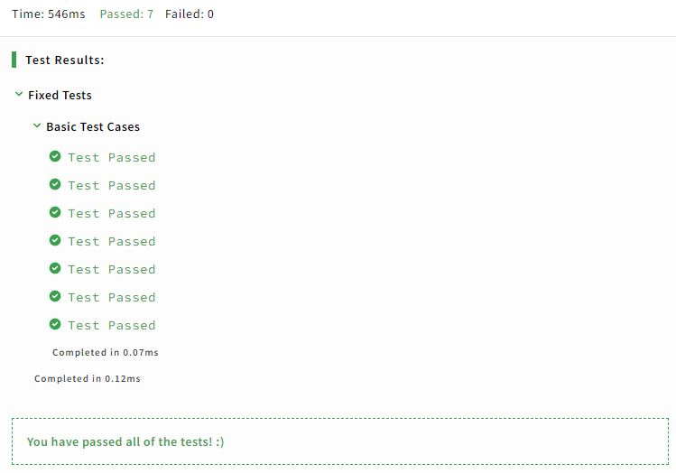

Python 8 kyu
============

|

.. contents:: Contents
    :local:

|

----

Multiply 
--------

**Categories:** ``debugging`` ``fundamentals``

**Problem:** This code does not execute properly. Try to figure out why.

**Starting Code:**
::
    
    def multiply(a, b):
        a * b

**Sample Tests:**
::

    import codewars_test as test
    from solution import multiply

    @test.describe("Fixed Tests")
    def fixed_tests():
        @test.it('Basic Test Cases')
        def basic_test_cases():
            test.assert_equals(multiply(2,1), 2)

**Solution:**
::

    def multiply(a, b):
        return a * b

**Output:**

**Notes:** The ``multiply`` function was called but was not defined to ``return`` a value. So I re-defined the function.

|

----

Next
----