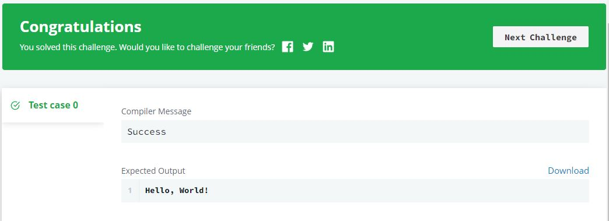

Python Introduction
===================

|

.. contents:: Contents
    :local:

|

----

Say "Hello, World!" with Python
-------------------------------

**Problem:** Here is a sample line of code that can be executed in Python:
::

    print("Hello, World!")

You can just as easily store a string as a variable and then print it to stdout:
::

    my_string = "Hello, World!"
    print(my_string)

The above code will print Hello, World! on your screen. Try it yourself in the editor below!

**Input Format**

You do not need to read any input in this challenge.

**Output Format**

Print ``Hello, World!`` to stdout.

**Sample Output 0**
::

    Hello, World!

**Starting Code:**
::

    if __name__ == '__main__':
    print("")

**Solution:**
::

    if __name__ == '__main__':
    print("Hello, World!")

**Output:**

**Notes:** I filled in the ``print`` function with the phrase ``Hello, World!``.

|

----

Next
----