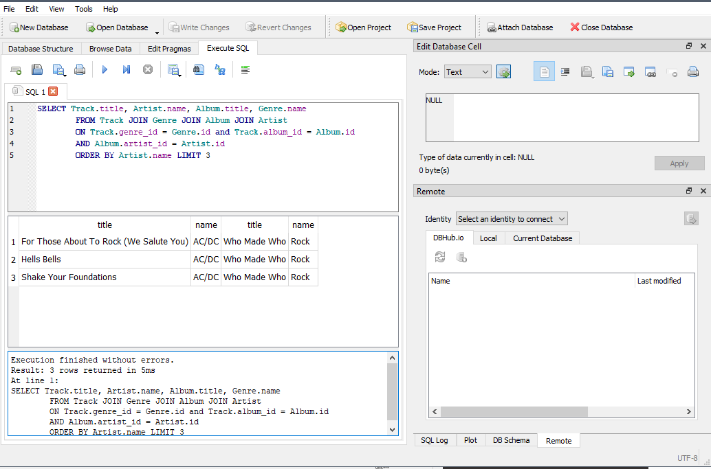

Databases
=========

|

.. contents:: Contents
    :local:

.. note::

    **Somethings to be familiar with:**

    In technical descriptions of relational databases the concepts of **table**, **row**, and **column** are more *formally* referred to as **relation**, **tuple**, and **attribute**, respectively.

    The acronym **CRUD** refers to the major operations which are implemented by *databases*. Each letter in the acronym can be mapped to a standard *Structured Query Language (SQL)* statement.

    .. list-table::
        :widths: 10 10
        :header-rows: 1

        * - CRUD
          - SQL

        * - Create
          - INSERT

        * - Read
          - SELECT

        * - Update
          - UPDATE

        * - Delete
          - DELETE

    **Normalization** refers to designing a data model so that no data is replicated. We store each item of data at one place in the database and reference it elsewhere using a foreign key.

    **Primary key** is a numeric key assigned to each row that is used to refer to one row in a table from another table. Often the database is configured to automatically assign primary keys as rows are inserted.

    **Foreign key** is a numeric key that points to the primary key of a row in another table. Foreign keys establish relationships between rows stored in different tables.

    **Logical key** is a key that the “outside world” uses to look up a particular row. For example in a table of user accounts, a person's email address might be a good candidate as the logical key for the user's data.

|

----

A Simple Single Table Design
----------------------------

**Process:**

The application will:

- Create a table if it does not already exist
- Clear out the database and fill it with new entries

**Testing methodology:**

The program will run the following query and produce a corresponding output:

*Query & output:*

.. code-block:: sql

    SELECT hex(name || age) AS X FROM Ages ORDER BY X

*Hint:*

.. code-block:: text

    Output starts with 436

**My Code:**
::

    # required library
    import sqlite3

    # set connection to specific database file or generate one
    # and initialize cursor/handle
    conn = sqlite3.connect('singleTable.sqlite3')
    cur = conn.cursor()

    # execute commands to create specific table
    # if the table already exists, delete all entries
    cur.executescript('''
        CREATE TABLE IF NOT EXISTS Ages (
            name VARCHAR(128),
            age INTEGER
        );

        DELETE FROM Ages;
    ''')

    # add entries into the table
    cur.executescript('''
        INSERT INTO Ages (name, age) VALUES ('Elshan', 19);
        INSERT INTO Ages (name, age) VALUES ('Tione', 22);
        INSERT INTO Ages (name, age) VALUES ('Spondon', 13);
        INSERT INTO Ages (name, age) VALUES ('Joanne', 35);
        INSERT INTO Ages (name, age) VALUES ('Nikela', 21);
        INSERT INTO Ages (name, age) VALUES ('Catrin', 16);
    ''')

    # commit updates to the database file
    conn.commit()

    # concatenate values of each row, from name to age, then
    # convert them to hexadecimal values and
    # present them in ascending order
    print('''
    Running command...

    SELECT hex(name || age) AS X FROM Ages ORDER BY X

    Output:
    ''')
    cur.execute('SELECT hex(name || age) AS X FROM Ages ORDER BY X')
    print(cur.fetchone()[0])

    # close connection to database file
    conn.close()

**My output:**
::

    $ python temporaryFile.py 

    Running command...

    SELECT hex(name || age) AS X FROM Ages ORDER BY X

    Output:

    43617472696E3136

**Notes:**

Some SQL commands used are strict syntaxes allowed within an SQLite database, such as the ``SELECT`` statement used in this program. I'm pointing this out since I'll only be working with the ``sqlite3`` library built within Python.

|

----

Approaches to Time Efficiency on Database Design
------------------------------------------------

**Process:**

This application will:

- Read the mailbox data in ``mbox.txt`` file.
- Count the number of email messages per organization (i.e. domain name of the email address) using a database to maintain the counts.
- Be created with different versions to see which approach performs with the best time efficiency.

Click link to open `reference code <https://www.py4e.com/code3/emaildb.py>`__.

Click link to open `mbox.txt <https://www.py4e.com/code3/mbox.txt>`__.

**Testing methodology:**

Each version of the program will run and find the domain name of the organization with the highest email count.

*Hint:*

.. code-block:: text

    The top organizational count is 536

**My Code:**

**Version 1: limiting string comparison in code**
::

    # required library and module
    import sqlite3
    from timeit import default_timer as timer

    # start timer and connection to database
    start = timer()
    conn = sqlite3.connect('countDomains.sqlite')
    cur = conn.cursor()

    # drop current table and create new one for testing
    cur.executescript('''
        DROP TABLE IF EXISTS Counts;

        CREATE TABLE Counts (
            id INTEGER NOT NULL PRIMARY KEY AUTOINCREMENT UNIQUE,
            org TEXT UNIQUE,
            count INTEGER);

    ''')

    # open connection to mbox.txt
    fname = 'mbox.txt'
    print(f'Opening file: {fname}')
    fhand = open(fname)

    # looking for specific lines and grab the domain names
    # then store them in the database
    for line in fhand:
        if not line.startswith('From: '): continue

        line = line.translate(str.maketrans('@', ' '))
        token = line.split()
        domain = token[2]

        cur.execute('SELECT id FROM Counts WHERE org = ?', (domain, ))
        row = cur.fetchone()

        if row is None:
            cur.execute('INSERT INTO Counts (org, count) VALUES (?, 1)', (domain, ))

        else:
            pKey = row[0]
            cur.execute('UPDATE Counts SET count = count + 1 WHERE id = ?', (pKey, ))

    conn.commit()

    cur.execute('SELECT org, count FROM Counts ORDER BY count DESC LIMIT 1')
    row = cur.fetchone()
    domain = row[0]
    count = row[1]

    print(f"\nTop Organizational Count\nDomain: {domain}\nCount: {count}")

    # close connection to database and stop timer
    conn.close()
    end = timer()
    print("Time elapsed:", round(end-start, 2), "second(s)")

**Output:**
::

    $ python temporaryFile.py 
    Opening file: mbox.txt

    Top Organizational Count
    Domain: iupui.edu       
    Count: 536
    Time elapsed: 0.38 second(s)

**Version 2: using string comparisons**
::

    import sqlite3
    from timeit import default_timer as timer

    start = timer()
    conn = sqlite3.connect('countDomains.sqlite')
    cur = conn.cursor()

    cur.executescript('''
        DROP TABLE IF EXISTS Counts;

        CREATE TABLE Counts (
            org TEXT UNIQUE,
            count INTEGER);

    ''')

    fname = 'mbox.txt'
    print(f'Opening file: {fname}')
    fhand = open(fname)

    for line in fhand:
        if not line.startswith('From: '): continue

        line = line.translate(str.maketrans('@', ' '))
        token = line.split()
        domain = token[2]

        cur.execute('SELECT count FROM Counts WHERE org = ?', (domain, ))
        row = cur.fetchone()

        if row is None:
            cur.execute('INSERT INTO Counts (org, count) VALUES (?, 1)', (domain, ))

        else:
            cur.execute('UPDATE Counts SET count = count + 1 WHERE org = ?', (domain, ))

    conn.commit()

    cur.execute('SELECT org, count FROM Counts ORDER BY count DESC LIMIT 1')
    row = cur.fetchone()
    domain = row[0]
    count = row[1]

    print(f"\nTop Organizational Count\nDomain: {domain}\nCount: {count}")

    conn.close()
    end = timer()
    print("Time elapsed:", round(end-start, 2), "second(s)")

**Output:**
::

    $ python temporaryFile.py 
    Opening file: mbox.txt

    Top Organizational Count
    Domain: iupui.edu       
    Count: 536
    Time elapsed: 0.48 second(s)

**Version 3: using dictionary to handle unique row inserts**
::

    import sqlite3
    from timeit import default_timer as timer

    start = timer()
    conn = sqlite3.connect('countDomains.sqlite')
    cur = conn.cursor()

    cur.executescript('''
        DROP TABLE IF EXISTS Counts;

        CREATE TABLE Counts (
            id INTEGER NOT NULL PRIMARY KEY AUTOINCREMENT UNIQUE,
            org TEXT UNIQUE,
            count INTEGER);

    ''')

    fname = 'mbox.txt'
    print(f'Opening file: {fname}')
    fhand = open(fname)
    domain = dict()

    for line in fhand:
        if not line.startswith('From: '): continue

        line = line.translate(str.maketrans('@', ' '))
        token = line.split()
        domain[token[2]] = domain.get(token[2], 0) + 1

    for org, count in domain.items():
        cur.execute('INSERT INTO Counts (org, count) VALUES (?, ?)', (org, count))

    conn.commit()

    cur.execute('SELECT org, count FROM Counts ORDER BY count DESC LIMIT 1')
    row = cur.fetchone()
    domain = row[0]
    count = row[1]

    print(f"\nTop Organizational Count\nDomain: {domain}\nCount: {count}")

    conn.close()
    end = timer()
    print("Time elapsed:", round(end-start, 2), "second(s)")

**Output:**
::

    $ python temporaryFile.py 
    Opening file: mbox.txt

    Top Organizational Count
    Domain: iupui.edu
    Count: 536
    Time elapsed: 0.44 second(s)

**Notes:**

Out of the 3 test versions, it seems searching through the database and limiting comparing string literals resulted in the best time efficiency. Of course, keep in mind that this is a small sample pool. But it's an interesting result, nonetheless.

|

----

Library Management - iTunes Edition
-----------------------------------

**Process:**

This application will:

- Read an iTunes export file in XML.
- Produce a properly normalized database.

Click link to download zip file containing `reference code and Library.xml file <https://www.py4e.com/code3/tracks.zip>`__.

**Testing methodology:**

The program will run the following query and retrieve the corresponding output:

*Query & output:*

.. code-block:: sql

    SELECT Track.title, Artist.name, Album.title, Genre.name 
    FROM Track JOIN Genre JOIN Album JOIN Artist 
    ON Track.genre_id = Genre.ID AND Track.album_id = Album.id 
    AND Album.artist_id = Artist.id
    ORDER BY Artist.name LIMIT 3

::

    Track                                   | Artist | Album        | Genre
    -----------------------------------------------------------------------
    For Those About To Rock (We Salute You) | AC/DC  | Who Made Who | Rock
    Hells Bells                             | AC/DC  | Who Made Who | Rock    
    Shake Your Foundations                  | AC/DC  | Who Made Who | Rock

**My code:**
::

    # required libraries
    import xml.etree.ElementTree as ET
    import sqlite3

    # create new or connect to existing database file
    # I'll name the file "multiTableTracks.sqlite"
    # cur acts as the file handle
    conn = sqlite3.connect("multiTableTracks.sqlite")
    cur = conn.cursor()

    # run SQL commands to drop existing tables and create new tables for testing
    cur.executescript('''
        DROP TABLE IF EXISTS Artist;
        DROP TABLE IF EXISTS Genre;
        DROP TABLE IF EXISTS Album;
        DROP TABLE IF EXISTS Track;

        CREATE TABLE Artist (
            id INTEGER NOT NULL PRIMARY KEY AUTOINCREMENT UNIQUE,
            name TEXT UNIQUE
        );

        CREATE TABLE Genre (
            id INTEGER NOT NULL PRIMARY KEY AUTOINCREMENT UNIQUE,
            name TEXT UNIQUE
        );

        CREATE TABLE Album (
            id INTEGER NOT NULL PRIMARY KEY AUTOINCREMENT UNIQUE,
            title TEXT UNIQUE,
            artist_id INTEGER
        );

        CREATE TABLE Track (
            id INTEGER NOT NULL PRIMARY KEY AUTOINCREMENT UNIQUE,
            title TEXT UNIQUE,
            length INTEGER,
            rating INTEGER,
            count INTEGER,
            genre_id INTEGER,
            album_id INTEGER
        );
    ''')

    # prompt for an xml file. Set default file if no input detected
    fname = input("Enter file name: ")
    if len(fname) < 1: fname = "Library.xml"

    # function designed to be called within the loop below
    # for each line of interest, the function will return the value
    # corresponding to the key being passed into the function
    # or returns None if no value is found
    def lookup(diction, key):
        found = False
        for child in diction:
            if found : return child.text
            if child.tag == 'key' and child.text == key:
                found = True
        return None

    # function designed to display SQL search commands
    def testMethod(method):
        print('\n'+'-' * 74)
        print(f'Running command...\n{method}')

        cur.execute(method)
        print("\nOutput:\n")

        output = cur.fetchall()

        t = ' '*4
        for entry in output:
            print(entry[0], t, entry[1], t, entry[2], t, entry[3])
            print('-'*80)

    # parse the xml file and store all read content located 
    # in a specific path and display count of items found
    readxml = ET.parse(fname)
    content = readxml.findall('dict/dict/dict')
    print(f"Track count: {len(content)}\n" )

    # loop through each item and perform SQL commands/queries
    iteration = 0
    for entry in content:
        # variables below shows the content the program is tracking
        track = lookup(entry, 'Track ID')
        name = lookup(entry, 'Name')
        artist = lookup(entry, 'Artist')
        album = lookup(entry, 'Album')
        genre = lookup(entry, 'Genre')
        count = lookup(entry, 'Play Count')
        rating = lookup(entry, 'Rating')
        length = lookup(entry, 'Total Time')

        # if one of these values are not found, the program will skip to the next item
        if track is None or name is None or artist is None or album is None or genre is None:
            continue

        # insert a unique artist name into the Artist table then query the
        # primary key and store it to be used as a foreign key
        cur.execute('INSERT OR IGNORE INTO Artist (name) VALUES (?)', (artist, ))
        cur.execute('SELECT id FROM Artist WHERE name = ?', (artist, ))
        artist_id = cur.fetchone()[0]

        # insert a unique genre name into the Genre table then query the
        # primary key and store it to be used as a foreign key
        cur.execute('INSERT OR IGNORE INTO Genre (name) VALUES (?)', (genre, ))
        cur.execute('SELECT id FROM Genre WHERE name = ?', (genre, ))
        genre_id = cur.fetchone()[0]

        # insert a unique album title and foreign key points to the Artist table
        # into the Album table then query the primary key and store it to be used
        # as a foreign key
        cur.execute('INSERT OR IGNORE INTO Album (title, artist_id) VALUES (?, ?)', (album, artist_id))
        cur.execute('SELECT id FROM Album WHERE title = ?', (album, ))
        album_id = cur.fetchone()[0]

        # insert track's information and foreign keys that points to Genre and Album tables 
        cur.execute('INSERT OR REPLACE INTO Track (title, length, rating, count, genre_id, album_id) VALUES (?, ?, ?, ?, ?, ?)', (name, length, rating, count, genre_id, album_id) )

        # force a write operation to the database file after every 20 entries
        iteration += 1
        if iteration == 20:
            conn.commit()
            iteration = 0

        print(name, artist, album, genre, count, rating, length)

    # force write on the last bit of data entries
    conn.commit()

    print("\nTrack count:", len(content))

    # run test query
    query = '''
        SELECT Track.title, Artist.name, Album.title, Genre.name 
        FROM Track JOIN Genre JOIN Album JOIN Artist 
        ON Track.genre_id = Genre.id and Track.album_id = Album.id 
        AND Album.artist_id = Artist.id
        ORDER BY Artist.name LIMIT 3'''
    testMethod(query)

    # close connection to database
    conn.close()

**My output:**
::

    $ python temporaryFile.py 
    Enter file name: Library.xml
    Track count: 404

    Another One Bites The Dust Queen Greatest Hits Rock 55 100 217103
    Asche Zu Asche Rammstein Herzeleid Industrial 79 100 231810
    Beauty School Dropout Various Grease Soundtrack 48 100 239960
    Black Dog Led Zeppelin IV Rock 109 100 296620
    Bring The Boys Back Home Pink Floyd The Wall [Disc 2] Rock 33 100 87118
    Circles Bryan Lee Blues Is Funk 54 60 355369
    Comfortably Numb Pink Floyd The Wall [Disc 2] Rock 36 100 384130
    Crazy Little Thing Called Love Queen Greatest Hits Rock 38 100 163631
    Electric Funeral Black Sabbath Paranoid Metal 44 100 293015
    Fat Bottomed Girls Queen Greatest Hits Rock 38 100 257515
    For Those About To Rock (We Salute You) AC/DC Who Made Who Rock 84 100 353750
    Four Sticks Led Zeppelin IV Rock 84 100 284421
    Furious Angels Rob Dougan The Matrix Reloaded Soundtrack 54 100 330004
    Gelle Bryan Lee Blues Is Blues/R&B 45 60 199836
    Going To California Led Zeppelin IV Rock 100 100 215666
    Grease Various Grease Soundtrack 42 100 205792
    Hand of Doom Black Sabbath Paranoid Metal 36 100 429609
    Hells Bells AC/DC Who Made Who Rock 82 100 312946
    Hey You Pink Floyd The Wall [Disc 2] Rock 23 100 282305
    I Worry Bryan Lee Blues Is Blues/R&B 33 100 341315
    Iron Man Black Sabbath Paranoid Metal 39 100 358530
    Is There Anybody Out There? Pink Floyd The Wall [Disc 2] Rock 26 100 160679
    It was a Very Good Year Frank Sinatra Greatest Hits Easy Listening 39 100 268852
    Its Your Move Bryan Lee Blues Is Blues/R&B 40 100 245002
    Jack the Stripper/Fairies Wear Boots Black Sabbath Paranoid Metal 35 100 373995
    Killer Queen Queen Greatest Hits Rock 34 100 181368
    Laichzeit Rammstein Herzeleid Industrial 41 100 262844
    Let me Down Easy Bryan Lee Blues Is Blues/R&B 43 100 331441
    Misty Mountain Hop Led Zeppelin IV Rock 88 100 278831
    No Low Down Bryan Lee Blues Is Blues/R&B 39 100 245760
    Now You Are Gone America Greatest Hits Easy Listening 52 100 187559
    Outside The Wall Pink Floyd The Wall [Disc 2] Rock 16 100 104437
    Paranoid Black Sabbath Paranoid Metal 36 100 172930
    Planet Caravan Black Sabbath Paranoid Metal 38 100 274938
    Pretty Jeanie Bryan Lee Blues Is Blues/R&B 34 100 225175
    Rammstein Rammstein Herzeleid Industrial 45 100 265090
    Rat Salad Black Sabbath Paranoid Metal 46 100 150230
    Rock & Roll Led Zeppelin IV Rock 109 100 220891
    Rode Across the Desert America Greatest Hits Easy Listening 60 100 249887
    Sandy Various Grease Soundtrack 36 100 155742
    Shake Your Foundations AC/DC Who Made Who Rock 85 100 233769
    Sister Golden Hair America Greatest Hits Easy Listening 60 100 202057
    Somebody To Love Queen Greatest Hits Rock 17 100 297586
    Stairway To Heaven Led Zeppelin IV Rock 93 100 481567
    Strangers in the Night Frank Sinatra Greatest Hits Easy Listening 42 100 158484
    Summer Nights Various Grease Soundtrack 35 100 216973
    Summer Wind Frank Sinatra Greatest Hits Easy Listening 46 100 177554
    Thats Life Frank Sinatra Greatest Hits Easy Listening 43 100 189988
    The Battle Of Evermore Led Zeppelin IV Rock 110 100 351529
    The Blues "Is" Bryan Lee Blues Is Blues/R&B 45 100 252238
    There it Is Bryan Lee Blues Is Blues/R&B 35 100 395441
    Think Bryan Lee Blues Is Blues/R&B 41 100 320339
    This Town Frank Sinatra Greatest Hits Easy Listening 44 100 185051
    Tin Man America Greatest Hits Easy Listening 50 100 210076
    Track 01 Billy Price Danger Zone Blues/R&B 47 100 261825
    Track 02 Billy Price Danger Zone Blues/R&B 42 100 165459
    Track 03 Billy Price Danger Zone Blues/R&B 41 100 206471
    Messin with the Kid The Canettes Blues Band Self Titled Blues/R&B 23 100 226377
    Track 04 Billy Price Danger Zone Blues/R&B 37 100 257175
    Stormy Monday The Canettes Blues Band Self Titled Blues/R&B 29 100 464143
    Track 05 Billy Price Danger Zone Blues/R&B 42 100 230295
    Waiting on Ice Bryan Lee Blues Is Blues/R&B 37 100 289384
    War Pigs/Luke's Wall Black Sabbath Paranoid Metal 38 100 478197
    We Are The Champions Queen Greatest Hits Rock 24 100 181864
    We Will Rock You Queen Greatest Hits Rock 33 100 123559
    When Somebody Loves You Frank Sinatra Greatest Hits Easy Listening 43 100 117263
    When The Levee Breaks Led Zeppelin IV Rock 83 100 427624
    You are the One that I Want Various Grease Soundtrack 31 100 169900
    You Done Me Wrong Bryan Lee Blues Is Blues/R&B 35 100 200097
    You Shook Me All Night Long AC/DC Who Made Who Rock 92 100 210938
    You're My Best Friend Queen Greatest Hits Rock 31 100 172643
    Zion Fluke The Matrix Reloaded Soundtrack 47 100 273528
    Who Made Who AC/DC Who Made Who Rock 110 100 207203
    D.T. AC/DC Who Made Who Rock 90 None 173714
    Sink the Pink AC/DC Who Made Who Rock 83 None 253466
    Ride On AC/DC Who Made Who Rock 75 None 351268
    Chase the Ace AC/DC Who Made Who Rock 93 None 181420
    Wollt Ihr Das Bett In Flammen Sehen Rammstein Herzeleid Industrial 50 None 317387
    Der Meister Rammstein Herzeleid Industrial 46 None 250801
    Weisses Fleisch Rammstein Herzeleid Industrial 52 None 215902
    Seemann Rammstein Herzeleid Industrial 34 None 288235
    Du Riechst So Gut Rammstein Herzeleid Industrial 50 None 289332
    Das Alte Leid Rammstein Herzeleid Industrial 46 None 344581
    Heirate Mich Rammstein Herzeleid Industrial 39 None 284734
    Herzeleid Rammstein Herzeleid Industrial 42 None 223425
    Baba O'Riley The Who Who's Next Rock 45 None 298448
    Bargain The Who Who's Next Rock 37 None 331676
    Love Ain't for Keeping The Who Who's Next Rock 24 None 130560
    My Wife The Who Who's Next Rock 17 None 213786
    The Song Is Over The Who Who's Next Rock 14 None 375797
    Getting In Tune The Who Who's Next Rock 27 None 288809
    Going Mobile The Who Who's Next Rock 28 100 221910
    Behind Blue Eyes The Who Who's Next Rock 43 None 221570
    Won't Get Fooled Again The Who Who's Next Rock 21 None 511111
    Folsom Prison Blues Johnny Cash The Legend Of Johnny Cash Country 47 100 170004
    I Walk The Line Johnny Cash The Legend Of Johnny Cash Country 33 100 165720
    Get Rhythm Johnny Cash The Legend Of Johnny Cash Country 35 100 134530
    Big River Johnny Cash The Legend Of Johnny Cash Country 51 None 152711
    Guess Things Happen That Way Johnny Cash The Legend Of Johnny Cash Country 35 None 111386
    Ring Of Fire Johnny Cash The Legend Of Johnny Cash Country 30 100 157100
    Jackson Johnny Cash The Legend Of Johnny Cash Country 35 100 166530
    A Boy Named Sue (live) Johnny Cash The Legend Of Johnny Cash Country 37 None 226063
    You Raise Me Up Selah Hiding Place Gospel & Religious 9 None 302262
    Hold On, I'm Coming The Canettes Blues Band On Tap & In the Can Blues/R&B 34 100 282566
    Got my Mojo Working The Canettes Blues Band On Tap & In the Can Blues/R&B 52 100 310517
    Sweet Home Chicago The Canettes Blues Band On Tap & In the Can Blues/R&B 27 100 375849
    Heavy Love The Canettes Blues Band On Tap & In the Can Blues/R&B 28 100 253544
    Cold Cold Feeling The Canettes Blues Band On Tap & In the Can Blues/R&B 43 100 261929
    Lonely Avenue The Canettes Blues Band On Tap & In the Can Blues/R&B 24 100 292022
    Good Morning Little Schoolgirl The Canettes Blues Band On Tap & In the Can Blues/R&B 20 100 278648
    Dust My Broom The Canettes Blues Band On Tap & In the Can Blues/R&B 24 100 299311
    Gimme' Some Lovin The Canettes Blues Band On Tap & In the Can Blues/R&B 35 100 227239
    Everybody Needs Somebody to Love The Canettes Blues Band On Tap & In the Can Blues/R&B 24 100 195186
    Black Magic Woman The Canettes Blues Band On Tap & In the Can Blues/R&B 31 100 442644
    Steppin' Rooster The Canettes Blues Band On Tap & In the Can Blues/R&B 21 100 704862
    Our Love is Drifting The Canettes Blues Band On Tap & In the Can Blues/R&B 15 100 292649
    Doin' 100 The Canettes Blues Band On Tap & In the Can Blues/R&B 20 100 343980
    Mother Joy Matt Ender Natural Wonders Music Sampler 1999 New Age 463 None 287294
    Soldier's Lament Steve McDonald Natural Wonders Music Sampler 1999 New Age 371 None 347193
    Dulaman Altan Natural Wonders Music Sampler 1999 New Age 403 None 223007
    The Arrow Chris Spheeris Natural Wonders Music Sampler 1999 New Age 416 None 319869
    Spanish Eyes La Esperanza Natural Wonders Music Sampler 1999 New Age 375 None 259030
    Banana Bay Luis Villegas Natural Wonders Music Sampler 1999 New Age 403 None 198060
    Aguas De Marco Rosa Passos Natural Wonders Music Sampler 1999 New Age 407 None 179408
    Tamborea Energipsy Natural Wonders Music Sampler 1999 New Age 355 None 235389
    Gone Hollie Smith Natural Wonders Music Sampler 1999 New Age 362 None 196414
    The Immigrant Joanie Madden Natural Wonders Music Sampler 1999 New Age 350 None 362631
    Pahrump-Big Water Cusco Natural Wonders Music Sampler 1999 New Age 342 None 191634
    Seeker's Quest Cheryl Gunn Natural Wonders Music Sampler 1999 New Age 337 None 236434
    Floating To Forever Dean Everson Natural Wonders Music Sampler 1999 New Age 337 None 351686
    Open Road Jeff Bailey Relaxing Jazz Jazz 10 None 318563
    Ruby Kaiser Chiefs Yours Truly, Angry Mob Alternative & Punk 13 None 205008
    The Angry Mob Kaiser Chiefs Yours Truly, Angry Mob Alternative & Punk 41 None 288313
    Heat Dies Down Kaiser Chiefs Yours Truly, Angry Mob Alternative & Punk 12 None 237061
    Highroyds Kaiser Chiefs Yours Truly, Angry Mob Alternative & Punk 10 None 199575
    Love's Not A Competition (But I'm Winning) Kaiser Chiefs Yours Truly, Angry Mob Alternative & Punk 11 None 197799
    Thank You Very Much Kaiser Chiefs Yours Truly, Angry Mob Alternative & Punk 11 None 157753
    I Can Do It Without You Kaiser Chiefs Yours Truly, Angry Mob Alternative & Punk 11 None 204199
    My Kind Of Guy Kaiser Chiefs Yours Truly, Angry Mob Alternative & Punk 10 None 246595
    Everything Is Average Nowadays Kaiser Chiefs Yours Truly, Angry Mob Alternative & Punk 16 None 164754
    Learnt My Lesson Well Kaiser Chiefs Yours Truly, Angry Mob Alternative & Punk 9 None 325955
    Try Your Best Kaiser Chiefs Yours Truly, Angry Mob Alternative & Punk 8 None 222511
    Retirement Kaiser Chiefs Yours Truly, Angry Mob Alternative & Punk 10 None 237426
    The Angry Mob [Live From Berlin] Kaiser Chiefs Yours Truly, Angry Mob Alternative & Punk 40 None 279066
    I Like To Fight Kaiser Chiefs Yours Truly, Angry Mob Alternative & Punk 8 None 218566
    From The Neck Down Kaiser Chiefs Yours Truly, Angry Mob Alternative & Punk 15 None 147226
    The Wisdom of Crowds: Why the Many Are Smarter than the Few Part 1 of 3 James Surowiecki The Wisdom of Crowds: Why the Many Are Smarter than the Few (Abridged Nonfiction) Business 15 None 8586749
    The Wisdom of Crowds: Why the Many Are Smarter than the Few Part 2 of 3 James Surowiecki The Wisdom of Crowds: Why the Many Are Smarter than the Few (Abridged Nonfiction) Business 9 None 8443432
    The Wisdom of Crowds: Why the Many Are Smarter than the Few Part 3 of 3 James Surowiecki The Wisdom of Crowds: Why the Many Are Smarter than the Few (Abridged Nonfiction) Business 3 None 4168829
    The Wisdom of Crowds: Why the Many Are Smarter Than the Few (Unabridged) Part 1 of 5 James Surowiecki The Wisdom of Crowds: Why the Many Are Smarter Than the Few (Unabridged) Nonfiction 4 None 7920893
    The Wisdom of Crowds: Why the Many Are Smarter Than the Few (Unabridged) Part 2 of 5 James Surowiecki The Wisdom of Crowds: Why the Many Are Smarter Than the Few (Unabridged) Nonfiction None None 7921106
    The Wisdom of Crowds: Why the Many Are Smarter Than the Few (Unabridged) Part 3 of 5 James Surowiecki The Wisdom of Crowds: Why the Many Are Smarter Than the Few (Unabridged) Nonfiction None None 7965736
    The Wisdom of Crowds: Why the Many Are Smarter Than the Few (Unabridged) Part 4 of 5 James Surowiecki The Wisdom of Crowds: Why the Many Are Smarter Than the Few (Unabridged) Nonfiction 1 None 9653330
    The Wisdom of Crowds: Why the Many Are Smarter Than the Few (Unabridged) Part 5 of 5 James Surowiecki The Wisdom of Crowds: Why the Many Are Smarter Than the Few (Unabridged) Nonfiction None None 746536
    Misty David Osborne Moonlight And Love Songs Classical 302 None 249312
    My Funny Valentine David Osborne Moonlight And Love Songs Classical 301 None 235885
    Since I Don't Have You David Osborne Moonlight And Love Songs Classical 288 None 251846
    Tenderly David Osborne Moonlight And Love Songs Classical 284 None 227395
    When I Fall In Love David Osborne Moonlight And Love Songs Classical 281 None 187768
    Unforgettable David Osborne Moonlight And Love Songs Classical 280 None 272927
    The Way You Look Tonight David Osborne Moonlight And Love Songs Classical 277 None 247222
    I've Grown Accustomed To Your Face David Osborne Moonlight And Love Songs Classical 280 None 148035
    Smoke Gets In Your Eyes David Osborne Moonlight And Love Songs Classical 277 None 198504
    Fly Me To The Moon David Osborne Moonlight And Love Songs Classical 275 None 182543
    Unchained Melody David Osborne Moonlight And Love Songs Classical 265 None 259369
    These Foolish Things Remind Me Of You David Osborne Moonlight And Love Songs Classical 267 None 184711
    La Vie En Rose David Osborne Moonlight And Love Songs Classical 259 None 276767
    As Time Goes By David Osborne Moonlight And Love Songs Classical 290 None 257985
    Pilot Fairly Legal Fairly Legal, Season 1 Drama 1 None 3847006
    hte postal service - the impor The Postal Service unreleased demo Electronic None None 193959
    Winter Wonderland Bing Crosby Seasons Greatings Holiday 163 None 144744
    Jingle Bells Frank Sinatra Seasons Greatings Holiday 271 None 121756
    White Christmas Bing Crosby Seasons Greatings Holiday 158 None 95634
    The Christmas Song Frank Sinatra Seasons Greatings Holiday 272 None 209632
    Little Drummer Boy Bing Crosby Seasons Greatings Holiday 154 None 178311
    Silent Night Frank Sinatra Seasons Greatings Holiday 257 None 149054
    Let It Snow Bing Crosby Seasons Greatings Holiday 154 None 125126
    Mistletoe And Holly Frank Sinatra Seasons Greatings Holiday 257 None 138501
    O Holy Night Bing Crosby Seasons Greatings Holiday 150 None 214021
    Have Yourself A Merry Little Christmas Frank Sinatra Seasons Greatings Holiday 252 None 208248
    Do You Hear What I Hear Bing Crosby Seasons Greatings Holiday 155 None 164728
    I'll Be Home For Christmas Frank Sinatra Seasons Greatings Holiday 249 None 190876
    Voices Disturbed The Sickness Alternative None None 191764
    The Game Disturbed The Sickness Alternative 1 None 227134
    Stupify Disturbed The Sickness Alternative 1 None 274233
    Down With The Sickness Disturbed The Sickness Alternative 1 None 278726
    Violence Fetish Disturbed The Sickness Alternative None None 203833
    Fear Disturbed The Sickness Alternative 4 None 227004
    Numb Disturbed The Sickness Alternative None None 224940
    Want Disturbed The Sickness Alternative None None 232803
    Conflict Disturbed The Sickness Alternative 5 None 275330
    Shout 2000 Disturbed The Sickness Alternative 1 None 257802
    Droppin' Plates Disturbed The Sickness Alternative 4 None 229302
    Meaning Of Life Disturbed The Sickness Alternative 3 None 242599
    PY4INF-01-Intro.mp3 Recording by Dr. Chuck Python for Informatics's official Podcast. Podcast 1 None 3428075
    Eben Upton: Raspberry Pi IEEE Computer Society Computing Conversations Podcast 2 None 661368
    Andrew Tanenbaum: Writing the Book on Networks IEEE Computer Society Computing Conversations Podcast 4 None 535040
    Massimo Banzi: Building Arduino IEEE Computer Society Computing Conversations Podcast 1 None 567745
    PY4INF-04-Functions.mp3 Recording by Dr. Chuck Python for Informatics's official Podcast. Podcast None None 1683800
    PY4INF-02-Expressions.mp3 Recording by Dr. Chuck Python for Informatics's official Podcast. Podcast None None 2578416
    PY4INF-03-Conditional.mp3 Recording by Dr. Chuck Python for Informatics's official Podcast. Podcast None None 2296058
    PY4INF-05-Iterations.mp3 Recording by Dr. Chuck Python for Informatics's official Podcast. Podcast 1 None 2804297
    PY4INF-06-Strings.mp3 Recording by Dr. Chuck Python for Informatics's official Podcast. Podcast None None 1677844
    PY4INF-07-Files.mp3 Recording by Dr. Chuck Python for Informatics's official Podcast. Podcast None None 1478713
    PY4INF-08-Lists.mp3 Recording by Dr. Chuck Python for Informatics's official Podcast. Podcast None None 1636231
    PY4INF-09-Dictionaries.mp3 Recording by Dr. Chuck Python for Informatics's official Podcast. Podcast None None 2254445
    PY4INF-10-Tuples.mp3 Recording by Dr. Chuck Python for Informatics's official Podcast. Podcast None None 1597596
    PY4INF-11-Regex.mp3 Recording by Dr. Chuck Python for Informatics's official Podcast. Podcast None None 2123702
    John C. Hollar: History of Computing IEEE Computer Society Computing Conversations Podcast 1 None 694073
    Bob Metcalfe: Ethernet at Forty IEEE Computer Society Computing Conversations Podcast None None 1031392
    Gordon Bell: Building Blocks of Computing IEEE Computer Society Computing Conversations Podcast 1 None 744620
    Ian Horrocks: Standardizing OWL IEEE Computer Society Computing Conversations Podcast 1 None 572212
    Katie Hafner: The Origins of the Internet IEEE Computer Society Computing Conversations Podcast 1 None 652460
    Larry Smarr: Building Mosaic IEEE Computer Society Computing Conversations Podcast None None 894693
    Len Kleinrock: The Theory of Packets IEEE Computer Society Computing Conversations Podcast 1 None 674742
    Mitchell Baker: The Mozilla Foundation IEEE Computer Society Computing Conversations Podcast None None 994246
    Pooja Sankar: Building the Piazza Collaboration System IEEE Computer Society Computing Conversations Podcast None None 496404
    Van Jacobson: Content-Centric Networking IEEE Computer Society Computing Conversations Podcast None None 780251
    The Apache Software Foundation IEEE Computer Society Computing Conversations Podcast None None 542484
    A Brief History of Packets IEEE Computer Society Computing Conversations Podcast None None 1004643
    Discovering JavaScript Object Notation IEEE Computer Society Computing Conversations Podcast None None 650971
    Inventing PHP IEEE Computer Society Computing Conversations Podcast None None 494915
    Monash Museum of Computing History IEEE Computer Society Computing Conversations Podcast None None 362657
    The Rise of JavaScript IEEE Computer Society Computing Conversations Podcast None None 526132
    Joseph Hardin: NCSA Mosaic IEEE Computer Society Computing Conversations Podcast None None 845635
    Len Kleinrock on the Internet's First Two Packets IEEE Computer Society Computing Conversations Podcast 1 None 594390
    Doug Van Houweling on Building the NSFNet IEEE Computer Society Computing Conversations Podcast None None 773146
    Computing Conversations: Nathaniel Borenstein on MIME IEEE Computer Society Computing Conversations Podcast None None 682135
    You Don't Mess Around With Jim Jim Croce Classic Hits Folk None None 184398
    Andrew S. Tanenbaum on MINIX IEEE Computer Society Computing Conversations Podcast None None 603000
    Computing Conversations: Elizabeth Fong on SQL Standards IEEE Computer Society Computing Conversations Podcast None None 533577
    Nii Quaynor on Bringing the Internet to Africa IEEE Computer Society Computing Conversations Podcast 1 None 673332
    PHP-09-Transactions.mp3 Created by Sakai SI 664 W14's official Podcast. Podcast None None 1728888
    PHP-01-Intro.mp3 Created by Sakai SI 664 W14's official Podcast. Podcast None None 2250624
    PHP-02-Install.mp3 Created by Sakai SI 664 W14's official Podcast. Podcast 1 None None
    PHP-04-Expressions.mp3 Created by Sakai SI 664 W14's official Podcast. Podcast None None 2168064
    PHP-05-Functions.mp3 Created by Sakai SI 664 W14's official Podcast. Podcast None None 1446792
    PHP-06-Strings.mp3 Created by Sakai SI 664 W14's official Podcast. Podcast None None 417696
    PHP-12-Sessions.mp3 Created by Sakai SI 664 W14's official Podcast. Podcast None None 3624312
    PHP-06-Objects.mp3 Created by Sakai SI 664 W14's official Podcast. Podcast None None 2455368
    SI664-13-JSON-A.mp3 Created by Sakai SI 664 W14's official Podcast. Podcast None None 4407672
    PHP-13-JavaScript.mp3 Created by Sakai SI 664 W14's official Podcast. Podcast None None 3650088
    PHP-09-Database-Design.mp3 Created by Sakai SI 664 W14's official Podcast. Podcast None None 3591072
    PHP-Tsugi-Install.mp3 Created by Sakai SI 664 W14's official Podcast. Podcast None None 3181656
    PHP-10-MySQL-PDO.mp3 Created by Sakai SI 664 W14's official Podcast. Podcast None None 4536685
    PHP-08-MySQL.mp3 Created by Sakai SI 664 W14's official Podcast. Podcast None None 3994656
    SI664-13-JSON-B.mp3 Created by Sakai SI 664 W14's official Podcast. Podcast None None 1484616
    IMS-Learning-Tools-Interoperability.mp3 Created by Sakai SI 664 W14's official Podcast. Podcast None None 2185848
    An Interview with Don Waters Matt Pasiewicz CNI Event Coverage Speech 2 None 1411082
    PY4INF-11-Regex.mp3 Recording by Dr. Chuck Python for Informatics's official Podcast. Podcast None None 2123702
    PY4INF-10-Tuples.mp3 Recording by Dr. Chuck Python for Informatics's official Podcast. Podcast None None 1597596
    PY4INF-09-Dictionaries.mp3 Recording by Dr. Chuck Python for Informatics's official Podcast. Podcast None None 2254445
    PY4INF-08-Lists.mp3 Recording by Dr. Chuck Python for Informatics's official Podcast. Podcast None None 1636231
    PY4INF-07-Files.mp3 Recording by Dr. Chuck Python for Informatics's official Podcast. Podcast None None 1478713
    PY4INF-06-Strings.mp3 Recording by Dr. Chuck Python for Informatics's official Podcast. Podcast None None 1677844
    PY4INF-05-Iterations.mp3 Recording by Dr. Chuck Python for Informatics's official Podcast. Podcast None None 2804297
    PY4INF-04-Functions.mp3 Recording by Dr. Chuck Python for Informatics's official Podcast. Podcast None None 1683800
    PY4INF-03-Conditional.mp3 Recording by Dr. Chuck Python for Informatics's official Podcast. Podcast None None 2296058
    PY4INF-02-Expressions.mp3 Recording by Dr. Chuck Python for Informatics's official Podcast. Podcast None None 2578416
    PY4INF-01-Intro.mp3 Recording by Dr. Chuck Python for Informatics's official Podcast. Podcast None None 3428075
    Py4Inf-11-Regex.mp3 Recording by Dr. Chuck Python for Informatics's official Podcast. Podcast None None 2123702
    Py4Inf-10-Tuples.mp3 Recording by Dr. Chuck Python for Informatics's official Podcast. Podcast None None 1597596
    Py4Inf-09-Dictionaries.mp3 Recording by Dr. Chuck Python for Informatics's official Podcast. Podcast None None 2254445
    Py4Inf-08-Lists.mp3 Recording by Dr. Chuck Python for Informatics's official Podcast. Podcast None None 1636231
    Py4Inf-07-Files.mp3 Recording by Dr. Chuck Python for Informatics's official Podcast. Podcast None None 1478713
    Py4Inf-06-Strings.mp3 Recording by Dr. Chuck Python for Informatics's official Podcast. Podcast None None 1677844
    Py4Inf-05-Iterations.mp3 Recording by Dr. Chuck Python for Informatics's official Podcast. Podcast None None 2804297
    Py4Inf-04-Functions.mp3 Recording by Dr. Chuck Python for Informatics's official Podcast. Podcast None None 1683800
    Py4Inf-03-Conditional.mp3 Recording by Dr. Chuck Python for Informatics's official Podcast. Podcast None None 2296058
    Py4Inf-02-Expressions.mp3 Recording by Dr. Chuck Python for Informatics's official Podcast. Podcast None None 2578416
    Py4Inf-01-Intro.mp3 Recording by Dr. Chuck Python for Informatics's official Podcast. Podcast None None 3428075
    Ian Foster on the Globus Project IEEE Computer Society Computing Conversations Podcast 1 None 538305
    Khan Academy and Computer Science IEEE Computer Society Computing Conversations Podcast 1 None 558837
    Guido van Rossumon the Early Years of Python IEEE Computer Society Computing Conversations Podcast 1 None 701884
    Guido van Rossum on the Modern Era of Python IEEE Computer Society Computing Conversations Podcast None None 741616
    John Resig on Building jQuery IEEE Computer Society Computing Conversations Podcast None None 595983
    Roy T. Fielding on Understanding the REST Style IEEE Computer Society Computing Conversations Podcast 1 None 683650
    Anil Jain: 25 Years of Biometric Recognition IEEE Computer Society Computing Conversations Podcast None None 661368
    Waste Management Undercover Boss Undercover Boss, Season 1 Reality TV 1 None 2565232
    Sleep Like a Baby Tonight U2 Songs of Innocence Rock None None 301641
    Evergreen The Black Crowes Warpaint Rock None None 261373
    Oh Josephine The Black Crowes Warpaint Rock None None 398907
    Movin' On Down the Line The Black Crowes Warpaint Rock None None 342693
    Wounded Bird The Black Crowes Warpaint Rock None None 263453
    Volcano U2 Songs of Innocence Rock None None 194116
    Wee Who See the Deep The Black Crowes Warpaint Rock None None 290520
    Cedarwood Road U2 Songs of Innocence Rock None None 265268
    Locust Street The Black Crowes Warpaint Rock None None 255240
    Raised By Wolves U2 Songs of Innocence Rock None None 245599
    The Troubles U2 Songs of Innocence Rock None None 285843
    This Is Where You Can Reach Me Now U2 Songs of Innocence Rock None None 305134
    God's Got It The Black Crowes Warpaint Rock None None 202653
    California (There Is No End to Love) U2 Songs of Innocence Rock None None 239846
    Every Breaking Wave U2 Songs of Innocence Rock None None 252162
    Interview With the Onion News Network Onion News Network Onion News Network, Season 1 Comedy 1 None 302002
    Song for Someone U2 Songs of Innocence Rock None None 226763
    The Miracle (Of Joey Ramone) U2 Songs of Innocence Rock None None 255382
    Iris (Hold Me Close) U2 Songs of Innocence Rock None None 319457
    Goodbye Daughters of the Revolution The Black Crowes Warpaint Rock None None 304147
    Walk Believer Walk The Black Crowes Warpaint Rock None None 280253
    Choice Hotels International Undercover Boss Undercover Boss, Season 2 Reality TV 1 None 2614047
    Microchip Jason Farnham YouTube Audio Library Dance & Electronic None None 114336
    Anant Agarwal IEEE Computer Society Computing Conversations Podcast None None 494000

    Track count: 404

    --------------------------------------------------------------------------
    Running command...

        SELECT Track.title, Artist.name, Album.title, Genre.name
        FROM Track JOIN Genre JOIN Album JOIN Artist
        ON Track.genre_id = Genre.id and Track.album_id = Album.id
        AND Album.artist_id = Artist.id
        ORDER BY Artist.name LIMIT 3

    Output:

    For Those About To Rock (We Salute You)      AC/DC      Who Made Who      Rock
    --------------------------------------------------------------------------------
    Hells Bells      AC/DC      Who Made Who      Rock
    --------------------------------------------------------------------------------
    Shake Your Foundations      AC/DC      Who Made Who      Rock
    --------------------------------------------------------------------------------

**Notes:**

Alternatively, once the program runs and all data are stored, we can query the database using the dedicated SQLite Browser for a more clean presentation of data.

|

----

Many Students in Many Courses
-----------------------------

**Process:**

This application will:

- Read roster data in JSON format.
- Parse the JSON file.
- Produce an SQLite database that contains a User, Course, and Member table.
- Populate the tables from the data file.

Click link to open `reference code <https://www.py4e.com/code3/roster/roster.py>`__.

Click link to download `roster_data.json <https://www.py4e.com/tools/sql-intro/roster_data.php?PHPSESSID=10a2f411ec9495fde4e2d2ead3e9585e>`__.

**Testing methodology:**

The program will run the following queries and retrieve corresponding outputs:

*Query & output:*

.. code-block:: sql

    SELECT User.name, Course.title, Member.role
    FROM User JOIN Member JOIN Course 
    ON User.id = Member.user_id AND Member.course_id = Course.id
    ORDER BY User.name DESC, Course.title DESC, Member.role DESC LIMIT 2;

::
    
    Name    | Course | Role
    -----------------------
    Zunaira | si206  | 0
    Zohair  | si363  | 0

*Query & output:*

.. code-block:: sql

    SELECT 'XYZZY' || hex(User.name || Course.title || Member.role ) AS X
    FROM User JOIN Member JOIN Course 
    ON User.id = Member.user_id AND Member.course_id = Course.id
    ORDER BY X LIMIT 1;

*Hint:*

.. code-block:: text

    Output starts with XYZZY416...

**My code:**
::

    # required libraries
    import json
    import sqlite3

    # create new or connect to existing database file. I'll name the file "rosterdb.sqlite3"
    # cur acts as the file handle
    conn = sqlite3.connect("rosterdb.sqlite3")
    cur = conn.cursor()

    # run SQL commands to drop existing tables and create new tables for testing
    cur.executescript('''
        DROP TABLE IF EXISTS User;
        DROP TABLE IF EXISTS Member;
        DROP TABLE IF EXISTS Course;

        CREATE TABLE User (
            id INTEGER NOT NULL PRIMARY KEY AUTOINCREMENT UNIQUE,
            name TEXT UNIQUE
        );

        CREATE TABLE Course (
            id INTEGER NOT NULL PRIMARY KEY AUTOINCREMENT UNIQUE,
            title TEXT UNIQUE
        );

        CREATE TABLE Member (
            user_id INTEGER,
            course_id INTEGER,
            role INTEGER,
            PRIMARY KEY (user_id, course_id)
        );
    ''')

    # prompt for a json file. Set default file if no input detected
    fname = input('Enter file name: ')
    if len(fname) < 1: fname = 'roster_data.json'

    # function designed to display column names
    def columnNames():
        spaces = ' ' * 14
        print(f'\nName{spaces}Course\tRole (0 for student, 1 for professor)')
        print('_' * 69)

    # function designed to display data entry from database when used inside a loop
    def prettyPrint(name, title, role):
        spaces = ' ' * (18 - len(name))
        print(f'{name}{spaces}{title}\t\t{role}')

    # function designed to display SQL search commands
    def testMethod(method, num):
        print('-' * 74)
        print(f'\nRunning command...\n{method}')
        
        cur.execute(method)
        print("\nOutput:")
        
        # depending on the command, the number of values retrieved will differ
        # so the output method will be conditional
        # this method is used when retrieving three values
        if num == 1:
            output = cur.fetchall()
            columnNames()
            for entry in output:
                prettyPrint(entry[0], entry[1], entry[2])

        # this method is used when retrieving one value
        if num == 2:
            output = cur.fetchone()[0]
            print('\n'+output)

    # open and read in all file content to str_data then parse the data
    str_data = open(fname).read()
    json_data = json.loads(str_data)

    # print column names
    columnNames()

    # loop through data objects and insert each entry into the database
    iteration = 0
    for entry in json_data:
        name = entry[0]
        title = entry[1]
        role = entry[2]

        # insert a unique name into the User table and grab the primary key
        # then store the primary key in a variable to be used as a foreign key
        cur.execute('INSERT OR IGNORE INTO User (name) VALUES (?)', (name, ))
        cur.execute('SELECT id FROM User WHERE name = ?', (name, ))
        user_id = cur.fetchone()[0]

        # insert a unique title into the Course table and grab the primary key
        # then store the primary key in a variable to be used as a foreign key
        cur.execute('INSERT OR IGNORE INTO Course (title) VALUES (?)', (title, ))
        cur.execute('SELECT id FROM Course WHERE title = ?', (title, ))
        course_id = cur.fetchone()[0]

        # insert a role and foreign keys associated the User and Course tables
        cur.execute('INSERT OR REPLACE INTO Member (user_id, course_id, role) VALUES (?, ?, ?)', (user_id, course_id, role))

        # force a write operation to the database file after every 20 entries
        iteration += 1
        if iteration == 20:
            conn.commit()
            iteration = 0

        # display each entry after being inserted
        prettyPrint(name, title, role)

    # force write on the last bit of data entries
    conn.commit()

    # test command #1
    method1 = '''
        SELECT User.name, Course.title, Member.role
        FROM User JOIN Member JOIN Course
        ON User.id = Member.user_id AND Member.course_id = Course.id
        ORDER BY User.name DESC, Course.title DESC, Member.role DESC LIMIT 2'''
    testMethod(method1, 1)

    # test command #2
    method2 = '''
        SELECT 'XYZZY' || HEX( User.name || Course.title || Member.role ) AS X
        FROM User JOIN Member JOIN Course
        ON User.id = Member.user_id AND Member.course_id = Course.id
        ORDER BY X LIMIT 1'''
    testMethod(method2, 2)

    # close connection to the database
    conn.close()

**My output:**

.. code-block:: text

    $ python temporaryFile.py 
    Enter file name: roster_data.json

    Name              Course        Role (0 for student, 1 for professor)
    _____________________________________________________________________
    Komal             si110         1
    Richard           si110         0
    Jac               si110         0
    Keiron            si110         0
    Jeanna            si110         0
    Avril             si110         0
    Kinga             si110         0
    Madox             si110         0
    Jesse             si110         0
    Munro             si110         0
    Yu                si110         0
    Krista            si110         0
    Jeanie            si110         0
    Precious          si110         0
    Lucyanne          si110         0
    Christie          si110         0
    Vicky             si110         0
    Eiley             si110         0
    Eshal             si110         0
    Kirie             si110         0
    Leylann           si110         0
    Roary             si110         0
    Saniya            si110         0
    Annalicia         si110         0
    Melica            si110         0
    Elen              si110         0
    Dareh             si110         0
    Rahim             si110         0
    Burak             si110         0
    Kerri             si106         1
    Elli              si106         0
    Amie              si106         0
    Arved             si106         0
    Jaiha             si106         0
    Haillie           si106         0
    Milana            si106         0
    Silas             si106         0
    Eduardo           si106         0
    Roman             si106         0
    Romey             si106         0
    Cale              si106         0
    Calypso           si106         0
    Juliet            si106         0
    Drew              si106         0
    Sofian            si106         0
    Shinade           si106         0
    Ali               si106         0
    Cator             si106         0
    Lilliana          si106         0
    Maximus           si106         0
    Rameen            si106         0
    Havin             si106         0
    Starr             si106         0
    Miranne           si106         0
    Kyral             si106         0
    Conley            si106         0
    Divya             si106         0
    Yaseen            si106         0
    Athena            si106         0
    Kenton            si106         0
    Evann             si106         0
    Nicolina          si106         0
    Filippo           si106         0
    Seth              si106         0
    Seonag            si106         0
    Kaeli             si106         0
    Ren               si106         0
    Lyndsay           si106         0
    Ferne             si106         0
    Alex              si106         0
    Ed                si106         0
    Queeneffa         si106         0
    Halyda            si206         1
    Sherwyn           si206         0
    Quinn             si206         0
    Zechariah         si206         0
    Morgen            si206         0
    Cabhan            si206         0
    Alister           si206         0
    Calley            si206         0
    Ieuan             si206         0
    Ame               si206         0
    Ezri              si206         0
    Skyla             si206         0
    Joaquin           si206         0
    Kaylee            si206         0
    Christopher       si206         0
    Zijie             si206         0
    Kelly             si206         0
    Viki              si206         0
    Kadi              si206         0
    Safara            si206         0
    Salymat           si206         0
    Calypso           si206         0
    Yingzi            si206         0
    Alastair          si206         0
    Sami              si206         0
    Mahan             si206         0
    Meledy            si206         0
    Zunaira           si206         0
    Jeannie           si206         0
    Brook             si206         0
    Zoha              si206         0
    Reis              si206         0
    Gene              si206         0
    Israa             si206         0
    Alhaji            si206         0
    Allie             si206         0
    Rhuaridh          si301         1
    Cesare            si301         0
    Olaoluwapolorimi  si301         0
    Ramsey            si301         0
    McCaulley         si301         0
    Ciaran            si301         0
    Karrah            si301         0
    Bradlie           si301         0
    Ryan              si301         0
    Richey            si301         0
    Bronwen           si301         0
    Ramsay            si301         0
    Ariana            si301         0
    Sherese           si301         0
    Rheanne           si301         0
    Shakira           si301         0
    Yaseen            si301         0
    Sahar             si301         0
    Dennan            si301         0
    Kaleb             si301         0
    Rhonda            si301         0
    Hibah             si301         0
    Havila            si310         1
    Charlotte         si310         0
    Linden            si310         0
    Tehzeeb           si310         0
    Anaya             si310         0
    Ahmad             si310         0
    Deia              si310         0
    Rehan             si310         0
    Missy             si310         0
    Dionne            si310         0
    Maciej            si310         0
    Reegan            si310         0
    Daegyu            si310         0
    Maxwell           si310         0
    Freya             si310         0
    Ryden             si310         0
    Aliyaan           si310         0
    Annan             si310         0
    Devrin            si310         0
    Nancy             si310         0
    Hashim            si310         0
    Aon               si310         0
    Deena             si310         0
    Eoghan            si310         0
    Kyral             si310         0
    Khyralee          si310         0
    Jarred            si310         0
    Meabh             si310         0
    Tyson             si310         0
    Asif              si310         0
    Damien            si310         0
    Eroni             si310         0
    Brea              si310         0
    Ruadhan           si310         0
    Phoevos           si310         0
    Ross              si310         0
    Mikka             si310         0
    Kaine             si310         0
    Reace             si310         0
    Eljon             si310         0
    Callun            si310         0
    Qainat            si310         0
    Manar             si310         0
    Robert            si310         0
    Eljay             si310         0
    Ayesha            si334         1
    Emilie            si334         0
    Kiarrah           si334         0
    Maddox            si334         0
    Leyland           si334         0
    Muzzammil         si334         0
    Ariella           si334         0
    Aida              si334         0
    Tian              si334         0
    Lydia             si334         0
    Ahmed             si334         0
    Bully             si334         0
    Narvic            si334         0
    Valentino         si334         0
    Taya              si334         0
    Abigayle          si334         0
    Tanisha           si334         0
    Lance             si334         0
    Tehya             si334         0
    Dolci             si334         0
    Belle             si334         0
    Kaydan            si334         0
    Ryder             si334         0
    Kevin             si334         0
    Pravin            si334         0
    Lena              si363         1
    Usmah             si363         0
    Oran              si363         0
    Antonio           si363         0
    Yago              si363         0
    Madeeha           si363         0
    Layney            si363         0
    Tiegan            si363         0
    Vincent           si363         0
    Rishi             si363         0
    Deshawn           si363         0
    Choco             si363         0
    Latoya            si363         0
    Siriol            si363         0
    Inaara            si363         0
    Artem             si363         0
    Saman             si363         0
    Demmi             si363         0
    Thorfinn          si363         0
    Mahasen           si363         0
    Otilija           si363         0
    Glenn             si363         0
    Prithivi          si363         0
    Dafydd            si363         0
    Eljay             si363         0
    Karlie            si363         0
    Bret              si363         0
    Zohair            si363         0
    Kory              si363         0
    Giuliana          si363         0
    Lucia             si363         0
    Keiva             si363         0
    Fearne            si363         0
    Leni              si363         0
    Ravin             si363         0
    Tereza            si363         0
    Ruadhan           si363         0
    Harper            si363         0
    Connan            si363         0
    Cain              si363         0
    Piper             si363         0
    Arun              si363         0
    Daniil            si363         0
    Linden            si363         0
    Eniola            si364         1
    Stevie            si364         0
    Aizah             si364         0
    Zaynah            si364         0
    Josie             si364         0
    Calli             si364         0
    Riha              si364         0
    Hadyn             si364         0
    Marieclare        si364         0
    Abbe              si364         0
    Caie              si364         0
    Abigael           si364         0
    Tokinaga          si364         0
    Ubaid             si364         0
    Mcbride           si364         0
    Modoulamin        si364         0
    Aronas            si364         0
    Dissanayake       si364         0
    Joynul            si364         0
    Kohen             si364         0
    Clyde             si364         0
    Callyn            si364         0
    Rahman            si364         0
    Aonghus           si364         0
    Kathrina          si364         0
    Honie             si364         0
    Lagan             si364         0
    Pietro            si364         0
    Sunehri           si422         1
    Reagan            si422         0
    Zacharias         si422         0
    Yousif            si422         0
    Maanisha          si422         0
    Chrystal          si422         0
    Selena            si422         0
    Effie             si422         0
    Afton             si422         0
    Malik             si422         0
    Teighan           si422         0
    Atal              si422         0
    Eliana            si422         0
    Quinn             si422         0
    Makala            si422         0
    Jensine           si422         0
    Alastair          si422         0
    Bruce             si422         0
    Tamarah           si422         0
    Elona             si422         0
    Alexandra         si422         0
    Robin             si422         0
    Kaye              si422         0
    Kamilah           si422         0
    Antigone          si422         0
    Loghan            si422         0
    Ander             si422         0
    Caley             si422         0
    Ezra              si422         0
    Simra             si422         0
    Wang              si422         0
    Kareena           si422         0
    Rhein             si430         1
    Otilia            si430         0
    Tristan           si430         0
    Ariella           si430         0
    Bernard           si430         0
    Monta             si430         0
    Muireann          si430         0
    Ami               si430         0
    Dagon             si430         0
    Marcquis          si430         0
    Dolci             si430         0
    Felicity          si430         0
    Beyza             si430         0
    Cadie             si430         0
    Sylvanna          si430         0
    Harneet           si430         0
    Kiaran            si430         0
    Wilhelmina        si430         0
    Conal             si430         0
    Somaya            si430         0
    --------------------------------------------------------------------------

    Running command...

        SELECT User.name, Course.title, Member.role
        FROM User JOIN Member JOIN Course
        ON User.id = Member.user_id AND Member.course_id = Course.id
        ORDER BY User.name DESC, Course.title DESC, Member.role DESC LIMIT 2

    Output:

    Name              Course        Role (0 for student, 1 for professor)
    _____________________________________________________________________
    Zunaira           si206         0
    Zohair            si363         0
    --------------------------------------------------------------------------

    Running command...

        SELECT 'XYZZY' || HEX( User.name || Course.title || Member.role ) AS X
        FROM User JOIN Member JOIN Course
        ON User.id = Member.user_id AND Member.course_id = Course.id
        ORDER BY X LIMIT 1

    Output:

    XYZZY41626265736933363430