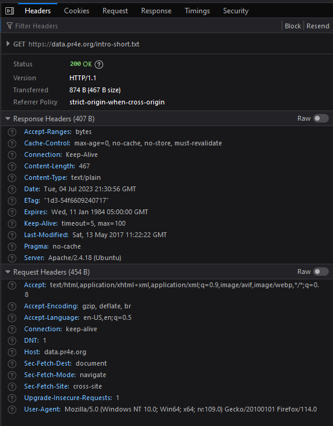

Network Programming
===================

|

.. contents:: Contents
    :local:

.. note::

    **Somethings to be familiar with:**

    We need to ``import`` the ``socket`` library for network programming.

    There are many documents that describe different network protocols. We'll be working with the Hypertext Transfer Protocol so refer to this document for detailed descriptions: https://www.w3.org/Protocols/rfc2616/rfc2616.txt

    To request a document from a web server, we make a connection, for example, to a server called ``www.pr4e.org server`` on port ``80``, and then send a line of the form:
    ::

        GET http://data.pr4e.org/romeo.txt HTTP/1.0

    Where the *second parameter* is the **web page** we are requesting, and then we also send a blank line. The *web server* will respond with some **header** information about the document and a **blank line** followed by the document **content**.
    
    .. code-block:: text

        HTTP/1.1 200 OK
        Date: Wed, 11 Apr 2018 18:52:55 GMT
        Server: Apache/2.4.7 (Ubuntu)
        Last-Modified: Sat, 13 May 2017 11:22:22 GMT
        ETag: "a7-54f6609245537"
        Accept-Ranges: bytes
        Content-Length: 167
        Cache-Control: max-age=0, no-cache, no-store, must-revalidate
        Pragma: no-cache
        Expires: Wed, 11 Jan 1984 05:00:00 GMT
        Connection: close
        Content-Type: text/plain

        But soft what light through yonder window breaks
        It is the east and Juliet is the sun
        Arise fair sun and kill the envious moon
        Who is already sick and pale with grief

    One of the requirements for using the HTTP protocol is the need to send and receive data as **bytes** objects, instead of strings. The ``encode()`` and ``decode()`` methods convert strings into bytes objects and back again.

    To a similar effect, you can use ``b''`` notation to specify that a variable should be stored as a bytes object. ``encode()`` and ``b''`` are equivalent.
    
    .. code-block:: text

        >>> b'Hello world'
        b'Hello world'
        >>> 'Hello world'.encode()
        b'Hello world'

    Another approach to network programming is to use the ``urllib`` library designed by folks that work on the Python language. One benefit of using this library is that it handles the connection protocol in it's code, making writing the code more efficient.

    One of the common uses of the ``urllib`` capability in Python is to *scrape* the web. **Web scraping** is when we write a program that pretends to be a web browser and retrieves pages, then examines the data in those pages looking for patterns.

    
    **BeautifulSoup** - A Python library for parsing HTML documents and extracting data from HTML documents that compensates for most of the imperfections in the HTML that browsers generally ignore. You can download the BeautifulSoup code from www.crummy.com. 
    
    **Port** - A number that generally indicates which application you are contacting when you make a socket connection to a server. As an example, web traffic usually uses port 80 while email traffic uses port 25. 
    
    **Scrape** - When a program pretends to be a web browser and retrieves a web page, then looks at the web page content. Often programs are following the links in one page to find the next page so they can traverse a network of pages or a social network. 
    
    **Socket** - A network connection between two applications where the applications can send and receive data in either direction. 
    
    **Spider** - The act of a web search engine retrieving a page and then all the pages linked from a page and so on until they have nearly all of the pages on the Internet which they use to build their search index.

|

----

Simple Browser with Socket Programming
----------------------------------------

**Process:**

The program will:

- Prompt user for a URL.
- Read the web page.
- Have error checking to prevent traceback errors.

Click to open `reference code <https://www.py4e.com/code3/socket1.py>`__.

**Testing methodology:**

The program will test for:

- Proper URL formatting via error checking.
- Existing URL via error checking.
- Typical output when input is entered correctly.

**My code:**
::

    import socket

    url = input("Enter URL in the format of \"http://<host-name>/<page-name>\": ")

    if len(url) < 1:
        url = "http://data.pr4e.org/romeo.txt"

    token = url.split('/')

    try:
        hostname = token[2]

    except:
        print("Please enter the URL in proper format!")
        exit()

    portnum = 80
    mysock = socket.socket(socket.AF_INET, socket.SOCK_STREAM)

    try:
        mysock.connect((hostname, portnum))

    except:
        print("Please enter an existing URL!")
        exit()

    cmd = f'GET {url} HTTP/1.0\r\n\r\n'.encode()
    mysock.send(cmd)

    while True:
        data = mysock.recv(512)
        if len(data) < 1:
            break
        print(data.decode(),end='')

    mysock.close()

**My outputs:**

*Catching improper URL format*
::

    $ python temporaryFile.py 
    Enter URL in the format of "http://<host-name>/<page-name>": google.com 
    Please enter the URL in proper format!

*Catching non-existent URL*
::

    $ python temporaryFile.py 
    Enter URL in the format of "http://<host-name>/<page-name>": htttpp://datt.pre4.org/romeon.txx
    Please enter an existing URL!

*Typical output*
::

    $ python temporaryFile.py 
    Enter URL in the format of "http://<host-name>/<page-name>": http://data.pr4e.org/romeo.txt
    HTTP/1.1 200 OK
    Date: Mon, 03 Jul 2023 03:42:36 GMT
    Server: Apache/2.4.18 (Ubuntu)
    Last-Modified: Sat, 13 May 2017 11:22:22 GMT
    ETag: "a7-54f6609245537"
    Accept-Ranges: bytes
    Content-Length: 167
    Cache-Control: max-age=0, no-cache, no-store, must-revalidate
    Pragma: no-cache
    Expires: Wed, 11 Jan 1984 05:00:00 GMT
    Connection: close
    Content-Type: text/plain

    But soft what light through yonder window breaks
    It is the east and Juliet is the sun
    Arise fair sun and kill the envious moon
    Who is already sick and pale with grief

**Notes:**

- The ``socket`` library needs to be imported for network programming.
- ``url`` asks and stores user input.
- ``if`` no input is entered, ``url`` is automatically initialized with a default input.
- The first ``try``/``except`` block tests to see if the input is in the proper format.
- The second ``try``/``except`` block tests to see if the URL is a valid link.
- ``cmd`` is edited to incorporate the user input.
- Once the input passes the checks, successfully, the socket is established and connected to the server side. The ``while`` loop runs for as long as the program receives packets from the server. Each packet is the size of 512 bytes. Notice the ``encode()`` and ``decode()`` methods. These are for switching *string type* to *byte type*. They're necessary for network programming.

|

----

Browser Config with Socket Programming
---------------------------------------------

**Process:**

The program will:

- Prompt user for a URL.
- Read the web page.
- Count the number of characters read.
- Stop displaying content to the console once 3000 characters are read.

Click to open `reference code <https://www.py4e.com/code3/socket1.py>`__.

**Testing methodology:**

The program will test for:

- Reading in of data, entirely.
- Total character count of the entire document.
- Displaying enough content to reach 3000 character count.

**My code:**
::

    import socket

    url = input("Enter URL in the format of \"http://<host-name>/<page-name>\": ")

    if len(url) < 1:
        url = "http://data.pr4e.org/romeo-full.txt"

    token = url.split('/')

    try:
        hostname = token[2]

    except:
        print("Please enter the URL in proper format!")
        exit()

    portnum = 80
    mysock = socket.socket(socket.AF_INET, socket.SOCK_STREAM)

    try:
        mysock.connect((hostname, portnum))

    except:
        print("Please enter an existing URL!")
        exit()

    cmd = f'GET {url} HTTP/1.0\r\n\r\n'.encode()
    mysock.send(cmd)

    displayCount = 0
    totalCount = 0
    charLimit = 3000

    while True:
        data = mysock.recv(500)
        totalCount += len(data)
        
        if len(data) < 1:
            break
        
        elif totalCount >= charLimit+1:
            displayCount = charLimit
            continue

        print(data.decode(), end='')

    print(f"\n\nDisplay stopped at character count of {displayCount}")
    print(f"Total number of characters received: {totalCount}")

    mysock.close()

**My output:**
::

    $ python temporaryFile.py 
    Enter URL in the format of "http://<host-name>/<page-name>": http://data.pr4e.org/romeo-full.txt
    HTTP/1.1 200 OK
    Date: Mon, 03 Jul 2023 21:53:38 GMT
    Server: Apache/2.4.18 (Ubuntu)
    Last-Modified: Sat, 13 May 2017 11:22:22 GMT
    ETag: "22a0-54f6609245537"
    Accept-Ranges: bytes
    Content-Length: 8864
    Cache-Control: max-age=0, no-cache, no-store, must-revalidate
    Pragma: no-cache
    Expires: Wed, 11 Jan 1984 05:00:00 GMT
    Connection: close
    Content-Type: text/plain

    Romeo and Juliet
    Act 2, Scene 2

    SCENE II. Capulet's orchard.

    Enter ROMEO

    ROMEO

    He jests at scars that never felt a wound.
    JULIET appears above at a window

    But, soft! what light through yonder window breaks?
    It is the east, and Juliet is the sun.
    Arise, fair sun, and kill the envious moon,
    Who is already sick and pale with grief,
    That thou her maid art far more fair than she:
    Be not her maid, since she is envious;
    Her vestal livery is but sick and green
    And none but fools do wear it; cast it off.
    It is my lady, O, it is my love!
    O, that she knew she were!
    She speaks yet she says nothing: what of that?
    Her eye discourses; I will answer it.
    I am too bold, 'tis not to me she speaks:
    Two of the fairest stars in all the heaven,
    Having some business, do entreat her eyes
    To twinkle in their spheres till they return.
    What if her eyes were there, they in her head?
    The brightness of her cheek would shame those stars,
    As daylight doth a lamp; her eyes in heaven
    Would through the airy region stream so bright
    That birds would sing and think it were not night.
    See, how she leans her cheek upon her hand!
    O, that I were a glove upon that hand,
    That I might touch that cheek!

    JULIET

    Ay me!

    ROMEO

    She speaks:
    O, speak again, bright angel! for thou art
    As glorious to this night, being o'er my head
    As is a winged messenger of heaven
    Unto the white-upturned wondering eyes
    Of mortals that fall back to gaze on him
    When he bestrides the lazy-pacing clouds
    And sails upon the bosom of the air.

    JULIET

    O Romeo, Romeo! wherefore art thou Romeo?
    Deny thy father and refuse thy name;
    Or, if thou wilt not, be but sworn my love,
    And I'll no longer be a Capulet.

    ROMEO

    [Aside] Shall I hear more, or shall I speak at this?

    JULIET

    'Tis but thy name that is my enemy;
    Thou art thyself, though not a Montague.
    What's Montague? it is nor hand, nor foot,
    Nor arm, nor face, nor any other part
    Belonging to a man. O, be some other name!
    What's in a name? that which we call a rose
    By any other name would smell as sweet;
    So Romeo would, were he not Romeo call'd,
    Retain that dear perfection which he owes
    Without that title. Romeo, doff thy name,
    And for that name which is no part of thee
    Take all myself.

    ROMEO

    I take thee at thy word:
    Call me but love, and I'll be new baptized;
    Henceforth I never will be Romeo.

    JULIET

    What man art thou that thus bescreen'd in night
    So stumblest on my counsel?

    ROMEO

    By a name
    I know not how to tell thee who I am:
    My name, dear saint, is hateful to myself,
    Because it is an enemy to thee;
    Had I it written, I would tear the word.

    JULIET

    My ears have not yet drunk a hundred words
    Of

    Display stopped at character count of 3000
    Total number of characters received: 9236

**Notes:**

- In the ``if`` block used to auto-assign a link for testing, the URL is changed to a bigger file to better test the code for this assignment.
- ``displayCount`` is created to hold the count of the character limit set by the **prompt**.
- ``totalCount`` is created to hold the total count of all characters that passed through the socket. 
- ``charLimit`` is created for ease of use and hide the fact that I had to hardcode for this assignment...
- The ``elif`` block below ``if len(data) < 1:`` is haphazardly put together to get the result expected by the **prompt**. I'm sure there are better ways of doing this... But it achieved the results, at least, for this assignment! But I don't feel good doing it this way...-_-
- Once everything is sent and received, the program will print out when it stopped display and what the total count of characters is in total.

|

----

Socket Programming Made Easy
----------------------------

**Process:**

The application will:

- Prompt the user for a URL.
- Retrieve document from the URL.
- Display up to 3000 characters to the console.
- Count the total number of characters read.
- Pretty much replicate the capabilities of the previous two programs, combined. And be built more easily through use of Python's ``urllib`` modules.

Click to open `reference code <https://www.py4e.com/code3/urllib1.py>`__.

**Testing methodology:**

This application will test for all capabilities of programs from the previous two sections.

**My code:**
::

    import urllib.request, urllib.parse, urllib.error

    url = input("Enter URL in the format of \"http://<host-name>/<page-name>\": ")

    if len(url) < 1:
        url = "http://data.pr4e.org/romeo-full.txt"

    fhand = urllib.request.urlopen(url)

    totalCount = 0
    displayCount = 0
    charLimit = 3000

    for line in fhand:
        line = line.decode().strip()
        totalCount += len(line)
        
        if displayCount < charLimit:
            displayCount += len(line)

            if not displayCount > charLimit:
                print(line)
            
            else:
                displayEnds = (charLimit - displayCount) + 1
                displayCount = displayCount - (displayCount - charLimit)
                print(line[:displayEnds])

    print(f"\nDisplay ends at character count of {displayCount}")
    print(f"Total number of characters received: {totalCount}")

**My output:**
::

    $ python temporaryFile.py 
    Enter URL in the format of "http://<host-name>/<page-name>": http://data.pr4e.org/romeo-full.txt
    Romeo and Juliet
    Act 2, Scene 2

    SCENE II. Capulet's orchard.

    Enter ROMEO

    ROMEO

    He jests at scars that never felt a wound.
    JULIET appears above at a window

    But, soft! what light through yonder window breaks?
    It is the east, and Juliet is the sun.
    Arise, fair sun, and kill the envious moon,
    Who is already sick and pale with grief,
    That thou her maid art far more fair than she:
    Be not her maid, since she is envious;
    Her vestal livery is but sick and green
    And none but fools do wear it; cast it off.
    It is my lady, O, it is my love!
    O, that she knew she were!
    She speaks yet she says nothing: what of that?
    Her eye discourses; I will answer it.
    I am too bold, 'tis not to me she speaks:
    Two of the fairest stars in all the heaven,
    Having some business, do entreat her eyes
    To twinkle in their spheres till they return.
    What if her eyes were there, they in her head?
    The brightness of her cheek would shame those stars,
    As daylight doth a lamp; her eyes in heaven
    Would through the airy region stream so bright
    That birds would sing and think it were not night.
    See, how she leans her cheek upon her hand!
    O, that I were a glove upon that hand,
    That I might touch that cheek!

    JULIET

    Ay me!

    ROMEO

    She speaks:
    O, speak again, bright angel! for thou art
    As glorious to this night, being o'er my head
    As is a winged messenger of heaven
    Unto the white-upturned wondering eyes
    Of mortals that fall back to gaze on him
    When he bestrides the lazy-pacing clouds
    And sails upon the bosom of the air.

    JULIET

    O Romeo, Romeo! wherefore art thou Romeo?
    Deny thy father and refuse thy name;
    Or, if thou wilt not, be but sworn my love,
    And I'll no longer be a Capulet.

    ROMEO

    [Aside] Shall I hear more, or shall I speak at this?

    JULIET

    'Tis but thy name that is my enemy;
    Thou art thyself, though not a Montague.
    What's Montague? it is nor hand, nor foot,
    Nor arm, nor face, nor any other part
    Belonging to a man. O, be some other name!
    What's in a name? that which we call a rose
    By any other name would smell as sweet;
    So Romeo would, were he not Romeo call'd,
    Retain that dear perfection which he owes
    Without that title. Romeo, doff thy name,
    And for that name which is no part of thee
    Take all myself.

    ROMEO

    I take thee at thy word:
    Call me but love, and I'll be new baptized;
    Henceforth I never will be Romeo.

    JULIET

    What man art thou that thus bescreen'd in night
    So stumblest on my counsel?

    ROMEO

    By a name
    I know not how to tell thee who I am:
    My name, dear saint, is hateful to myself,
    Because it is an enemy to thee;
    Had I it written, I would tear the word.

    JULIET

    My ears have not yet drunk a hundred words
    Of that tongue's utterance, yet I know the sound:
    Art thou not Romeo and a Montague?

    ROMEO

    Neither, fair saint, if either thee dislike.

    JULIET

    How camest thou hither, tell me, and wherefore?
    The orchard walls are high and hard to climb,
    And the place death, considering who thou art,
    If any of my kinsmen find thee here.

    ROMEO

    With love's light wings did I o'er-perch these walls;
    For stony limits cannot hold love out,
    And what love can do that dares love attempt;
    Therefore thy kinsmen a

    Display ends at character count of 3000
    Total number of characters received: 8473

**Notes:**

- For this assignment we'll need to ``import`` the ``request``, ``parse`` and ``error`` classes from ``urllib`` library.
- ``if`` no user input is detected, ``url`` will be initialized with a default value.
- With ``urllib`` we can manipulate web pages as if they're local files.
- ``fhand`` sends a GET request to open the access to the URL.
- ``totalCount`` holds the number of all characters that passes through the socket.
- ``displayCount`` is used to test against ``charLimit`` and should hold a value of ``3000`` after the web page is read.
- The ``for`` loop will read through the web page, line by line.
- Each ``line`` will be decoded from *bytes* to *strings* and stripped of *end-of-line* characters.
- As ``totalCount`` starts counting after each line, the program will check to see ``if`` the ``displayCount`` less than or larger than ``charLimit``. If it's less than, ``displayCount`` will starts to count. After finally being larger than the limit, ``displayEnds`` will calculate where, on the line, to print and stops after the 3000th character is reached.
- Due to ``displayCount`` overshooting the count a little bit by the end, the variable will change it value based on the calculation of ``displayCount - (displayCount - charLimit)``.
- Once all is tallied up, the program will print out where the display ends and the total number of characters that passes through the socket.

|

----

Simple Web Scraper
------------------

**Process:**

The application will:

- Prompt the user for a URL.
- Extract and count paragraph ``
`` tags from the retrieved HTML document.
- Display the count of ``
`` tags to the console.

Click to open `reference code <https://www.py4e.com/code3/urllinks.py>`__.

**Testing methodology:**

The application will test with multiple sized web pages and display ``
`` tags found.

**My code:**
::

    # this is how to import BeautifulSoup if it's installed via pip package manager
    from soupsieve import bs4
    import urllib.request, urllib.parse, urllib.error
    import ssl

    # ignore SSL certificate errors
    ctx = ssl.create_default_context()
    ctx.check_hostname = False
    ctx.verify_mode = ssl.CERT_NONE

    # request for URL and pass it through BeautifulSoup
    url = input('Enter - ')
    html = urllib.request.urlopen(url, context=ctx).read()
    soup = bs4.BeautifulSoup(html, 'html.parser')

    # retrieve all of the paragraph tags and count them
    tags = soup('p')
    count = 0
    for tag in tags:
        count += 1

    # print out the total count of paragraph tags found in web page
    print(f"Total count of paragraph tags is {count}")

**My outputs:**

*Small size web page #1*
::

    $ python temporaryFile.py 
    Enter - http://www.dr-chuck.com/page1.htm 
    Total count of paragraph tags is 1

*Small size web page #2*
::

    $ python temporaryFile.py 
    Enter - https://www.dr-chuck.com/page2.htm 
    Total count of paragraph tags is 1

*Medium size web page*
::

    $ python temporaryFile.py 
    Enter - https://www.python.org
    Total count of paragraph tags is 23

*Large size web page*
::

    $ python temporaryFile.py 
    Enter - https://www.yinza.com/Fandom/Script/01.html
    Total count of paragraph tags is 192

|

----

Browser Config with Socket Programming II
-----------------------------------------

**Process:**

This application will:

- Perform a more advanced technique in socket programming.
- Only show content of the web page once it determines that the header as been received.
- Display only the content of the web page.

Click to open `reference code <https://www.py4e.com/code3/socket1.py>`__.

**Testing methodology:**

The application will test its error checking capabilities and display necessary content of the web page entered by the user.

**My code:**
::

    import socket

    url = input("Enter a URL: ")
    port = 80

    # used for testing/debugging
    if len(url) < 1:
        url = 'http://data.pr4e.org/romeo.txt'

    tokens = url.split('/')

    try:
        host = tokens[2]

    except:
        print("Please enter the URL in proper format!")
        exit()

    mysock = socket.socket(socket.AF_INET, socket.SOCK_STREAM)

    try:
        mysock.connect((host, port))

    except:
        print("Please enter an existing URL!")
        exit()

    cmd = f'GET {url} HTTP/1.0\r\n\r\n'.encode()
    mysock.send(cmd)

    # 'content' to hold the web page's content
    content = ""
    while True:
        data = mysock.recv(512)

        if len(data) < 1:
            break

        # data is appended to content, 512 bytes at a time
        content += data.decode()

    # locating the blank line after the header info
    pos = content.find('\r\n\r\n')

    # print the content after skipping the position of the end line characters
    print(content[pos+4:])

**My outputs:**

*Catching improper formatting*
::

    $ python temporaryFile.py 
    Enter a URL: google.com
    Please enter the URL in proper format!

*Catching non-existent URL*
::

    $ python temporaryFile.py 
    Enter a URL: htttpp:///dat.pro4e.org/romeo.txt
    Please enter an existing URL!

*Typical output*
::

    $ python temporaryFile.py 
    Enter a URL: http://data.pr4e.org/romeo.txt
    But soft what light through yonder window breaks
    It is the east and Juliet is the sun
    Arise fair sun and kill the envious moon
    Who is already sick and pale with grief

|

----

Analyzing Request-Response Cycle
--------------------------------

**Process:**

The application will:

- Retrieve the following document using the HTTP protocol in a way that it can examine the HTTP Response headers.
- Display the header values in the following fields:
   
  - Last-Modified
  - ETag
  - Content-Length
  - Cache-Control
  - Content-Type

Click to open `reference code <https://www.py4e.com/code3/socket1.py>`__.

Click to open `test data <https://data.pr4e.org/intro-short.txt>`__.

**Testing methodology:**

The application will test using the test data URL and display header values of interest.

**My code:**
::

    import socket
    import re

    mysock = socket.socket(socket.AF_INET, socket.SOCK_STREAM)
    mysock.connect(('data.pr4e.org', 80))
    cmd = f'GET http://data.pr4e.org/intro-short.txt HTTP/1.0\r\n\r\n'.encode()
    mysock.send(cmd)

    # variable to hold web page's data
    content = ""
    while True:
        data = mysock.recv(512)

        if len(data) < 1:
            break

        content += data.decode()

    print(content)

    # Extra work you don't have to do for this assignment below

    # list holding regex patterns for each requested value
    headerValues = ["(L.*)", "(E.*)", "(C.*-L.*)", "(C.*-C.*)", "(C.*-T.*)"]

    # list comprehension to search for header values via regex
    # and append them to 'lista'
    lista = [ re.findall(regex, content)[0].strip() for regex in headerValues ]

    # formatted print
    print('-------------------------------------------------------------')
    print("Extracted values:")

    for value in lista:
        print(value)

**My output:**
::

    $ python temporaryFile.py 
    HTTP/1.1 200 OK
    Date: Wed, 05 Jul 2023 00:27:37 GMT
    Server: Apache/2.4.18 (Ubuntu)
    Last-Modified: Sat, 13 May 2017 11:22:22 GMT
    ETag: "1d3-54f6609240717"
    Accept-Ranges: bytes
    Content-Length: 467
    Cache-Control: max-age=0, no-cache, no-store, must-revalidate
    Pragma: no-cache
    Expires: Wed, 11 Jan 1984 05:00:00 GMT
    Connection: close
    Content-Type: text/plain

    Why should you learn to write programs?

    Writing programs (or programming) is a very creative
    and rewarding activity.  You can write programs for
    many reasons, ranging from making your living to solving
    a difficult data analysis problem to having fun to helping
    someone else solve a problem.  This book assumes that
    everyone needs to know how to program, and that once
    you know how to program you will figure out what you want
    to do with your newfound skills.

    -------------------------------------------------------------
    Extracted values:
    Last-Modified: Sat, 13 May 2017 11:22:22 GMT
    ETag: "1d3-54f6609240717"
    Content-Length: 467
    Cache-Control: max-age=0, no-cache, no-store, must-revalidate
    Content-Type: text/plain

**Notes:**

*Developer tools method*

Another way to extract header information is through using a web browser's developer feature. To showcase this method, I'll be using *Firefox's* built-in *Developer Tools*. First we enter the link to the web page into the *address bar*.

The link is https://data.pr4e.org/intro-short.txt.

Once in the page, *right-click and click* on the option to **Inspect (Q)**. Then go into the **Network** tab and click on the **Reload** button. A line showing the domain name ``data.pr4e.org`` and file name ``intro-short.txt`` would populate. Clicking on that line will show the header info. In there, we can see header values we want amongst other ones.

|

----

Web Scraper with BeautifulSoup
------------------------------

**Process:**

This application will:

- Prompt user for a URL.
- Read in the web page.
- Parse the data.
- Scrape and extract numbers from the page's HTML.
- Compute the sum of the numbers extracted.
- Display results to the console.

The sample data consist of a table of names and comment counts. The application will ignore most of the data in the file except for lines like the following: 

.. code-block:: html

    <tr><td>Modu</td><td>90</td></tr>
    <tr><td>Kenzie</td><td>88</td></tr>
    <tr><td>Hubert</td><td>87</td></tr>

Click to open `reference code <http://www.py4e.com/code3/urllink2.py>`__.

Click to open `small sample data <http://py4e-data.dr-chuck.net/comments_42.html>`__.

Click to open `large sample data <http://py4e-data.dr-chuck.net/comments_1784990.html>`__.

**Testing methodology:**

The application will be fed two sample data, small and large in size. It will then loop through HTML tags to reach the necessary content before scraping and extracting it.

*Sample execution*
::

    $ python3 solution.py
    Enter - http://py4e-data.dr-chuck.net/comments_42.html
    Count 50
    Sum 2...

*Hint*

.. code-block:: text

    Small sample data should have sum of 2553
    Large sample data should have a sum that ends with 0

**My code:**
::

    import urllib.parse, urllib.error
    from urllib.request import urlopen
    from bs4 import BeautifulSoup

    url = input("Enter - ")

    if len(url) < 1:
        url = 'http://py4e-data.dr-chuck.net/comments_42.html'
        
    html = urlopen(url).read()
    soup = BeautifulSoup(html, "html.parser")

    count = 0
    total = 0
    tags = soup('span')
    for tag in tags:
        total += int(tag.contents[0])
        count += 1

    print(f'Count {count}\nSum {total}')

**My outputs:**

*small sample data*
::

    $ python temporaryFile.py 
    Enter - http://py4e-data.dr-chuck.net/comments_42.html
    Count 50
    Sum 2553

*large sample data*
::

    $ python temporaryFile.py 
    Enter -  http://py4e-data.dr-chuck.net/comments_1784990.html
    Count 50
    Sum 2700

**Notes:**

- The typical modules need to be imported from ``urllib`` are ``request``, ``parser`` and ``error``. From ``request`` I imported ``urlopen`` to make it easier to call the object in the main code.
- The typical module need to be imported from ``bs4`` is ``BeautifulSoup``.
- ``url`` asks and stores a URL.
- ``if`` no user input is detected, ``url`` will auto-assign with a default URL.
- ``html`` is to store the content ``read`` in from the ``urlopen`` function call.
- ``soup`` is to initialize ``BeautifulSoup`` to read and parse html code.
- ``count`` is used to test against the **expected output** to see if my code would detect the same number of **** tags.
- ``total`` is to hold the sum of all the tag's contents.
- ``soup`` is given an argument of ``'span'`` and any matches found will be stored in ``tags``.
- Looping through the tags, the program will extract all the numbers via ``tag.contents[0]``. The numbers are then converted to ``int`` type and added.
- Once completed, the program prints out the ``count`` and ``total`` to the console. 

|

----

Web-links Spider with BeautifulSoup
-----------------------------------

**Process:**

The application will:

- Prompt user for a URL.
- Extract the **href=** values from the **anchor** tags.
- Scan for a tag that is in a particular position relative to the first name in the list.
- Follow the link attached to the first name and *repeat* the process a number of times and report the last name it found.

Click to open `reference code <http://www.py4e.com/code3/urllinks.py>`__.

Click to open `small sample data <http://py4e-data.dr-chuck.net/known_by_Fikret.html>`__.

Click to open `large sample data <http://py4e-data.dr-chuck.net/known_by_Wojciech.html>`__.

**Testing methodology:**

The application will test for:

*Small sample data*

- Find the link at position ``3``. Follow that link. Repeat this process ``4`` times. The answer is the last name that you retrieve.
- **[Hint]** *Sequence of names:* ``Fikret Montgomery Mhairade Butchi Anayah``
- **[Hint]** *Last name in sequence:* ``Anayah``

*Large sample data*

- Find the link at position ``18``. Follow that link. Repeat this process ``7`` times. The answer is the last name that you retrieve.
- **[Hint]** The first character of the name of the last page that you will load is: ``N``

*Sample execution*
::

    $ python3 solution.py
    Enter URL: http://py4e-data.dr-chuck.net/known_by_Fikret.html
    Enter count: 4
    Enter position: 3
    Retrieving: http://py4e-data.dr-chuck.net/known_by_Fikret.html
    Retrieving: http://py4e-data.dr-chuck.net/known_by_Montgomery.html
    Retrieving: http://py4e-data.dr-chuck.net/known_by_Mhairade.html
    Retrieving: http://py4e-data.dr-chuck.net/known_by_Butchi.html
    Retrieving: http://py4e-data.dr-chuck.net/known_by_Anayah.html

The answer to the assignment for this execution is **"Anayah"**.

**My code:**
::

    # required libraries/modules
    import urllib.parse, urllib.error
    from urllib.request import urlopen
    from bs4 import BeautifulSoup
    import re

    # requests URL, number of repetition and position of the link
    url = input("Enter URL: ")
    count = input("Enter count: ")
    pos = input("Enter position: ")

    # used for testing/debugging
    if len(url) < 1:
        url = 'http://py4e-data.dr-chuck.net/known_by_Wojciech.html'
        count = 7
        pos = 18

    count = int(count)
    pos = int(pos)

    # records current name from URL and store it in a list structure
    sequence = re.findall("by_([A-za-z]+)[.]", url)

    # runs until number of repetition achieved
    while True:
        
        # prints 'Retrieving' message of current URL to match sample execution
        print(f'Retrieving: {url}')

        if count == 0: break

        # reads the whole web page
        html = urlopen(url).read()

        # adjusts bs4 to parse html docs
        soup = BeautifulSoup(html, "html.parser")

        # finds all lines containing anchor tags, up to a limit, and store them
        # in a list structure
        tags = soup.find_all('a', limit=pos)

        # extracts the name we're looking for and store in str type
        name = tags[pos-1].contents[0]

        # appends current name to the sequence list
        sequence.append(name)

        # extracts the URL we're looking for and store in str type
        url = tags[pos-1].get('href')

        count -= 1

    # formatted outputs
    print('\nSequence of names: ', end='')
    for name in sequence:
        print(name, end=' ')

    print(f'\nLast name in sequence: {sequence[-1]}')

**My outputs:**

*Small sample data*
::

    $ python temporaryFile.py 
    Enter URL: http://py4e-data.dr-chuck.net/known_by_Fikret.html
    Enter count: 4
    Enter position: 3
    Retrieving: http://py4e-data.dr-chuck.net/known_by_Fikret.html
    Retrieving: http://py4e-data.dr-chuck.net/known_by_Montgomery.html
    Retrieving: http://py4e-data.dr-chuck.net/known_by_Mhairade.html
    Retrieving: http://py4e-data.dr-chuck.net/known_by_Butchi.html
    Retrieving: http://py4e-data.dr-chuck.net/known_by_Anayah.html

    Sequence of names: Fikret Montgomery Mhairade Butchi Anayah 
    Last name in sequence: Anayah

*Large sample data*
::

    $ python temporaryFile.py 
    Enter URL: http://py4e-data.dr-chuck.net/known_by_Wojciech.html
    Enter count: 7
    Enter position: 18
    Retrieving: http://py4e-data.dr-chuck.net/known_by_Wojciech.html
    Retrieving: http://py4e-data.dr-chuck.net/known_by_Lucca.html
    Retrieving: http://py4e-data.dr-chuck.net/known_by_Emon.html
    Retrieving: http://py4e-data.dr-chuck.net/known_by_Laticha.html
    Retrieving: http://py4e-data.dr-chuck.net/known_by_Harikrishna.html
    Retrieving: http://py4e-data.dr-chuck.net/known_by_Kenzi.html
    Retrieving: http://py4e-data.dr-chuck.net/known_by_Maya.html
    Retrieving: http://py4e-data.dr-chuck.net/known_by_Naima.html

    Sequence of names: Wojciech Lucca Emon Laticha Harikrishna Kenzi Maya Naima
    Last name in sequence: Naima

The answer to the assignment for this execution is **"Naima"**.

**Notes:**

I've commented in the code for this assignment. But seeing that this assignment is on the more difficult side of things, for me, I will go further in-depth here, in this section, for my benefit and yours! :)

There are many ways to go about tackling this assignment. I've seen others' solutions that are shorter and longer than mine. And the thing that sets me apart from other solutions is that... I chose the path of incorporating regular expression into my code and made it more complicated... so with all the necessary libraries/modules being imported, I also ``import`` the ``re`` library.

The first part of the code is the typical request for user's inputs and set the variables with default assignments if no input is detected. Then I created ``sequence`` as a way to extract the first name from the URL and input it as the first element in the list. Everything following will be performed in the ``while`` loop until ``count`` is down to ``0``.

Inside the loop, the program will first output the current ``url`` to the console. Then it'll check on ``count`` to see if it's ``0`` or not. If it's not yet ``0``, the program will execute the next line of code. In the next line, ``html`` is initialized with the entire HTML document, opened by ``urlopen()`` and read through via ``read()``.

``soup`` is designed to adjust ``BeautifulSoup`` to handle HTML docs and parse through them. Going through the HTML doc, ``tags`` calls ``soup`` to find all the *anchor* tags, up to the ``limit`` of the URL *position* that the user set in ``pos``. So in this case, ``soup`` will loop through ``18`` *anchor* tags. Each time one is found, it will be appended to ``tags``.

To grab the name from each HTML line, I created ``name``. This variable will locate the line of interest using ``pos`` as the index. The ``-1`` is because the list's starting index is ``0``. Once the name is found, it will be appended to ``sequence``.

The ``url`` value will then change to the new URL to prep for the next URL call. This is done similar to how the program grabs the name from the HTML line, except instead of looking for the ``contents``, it'll look for ``href``, which holds a reference to the new URL.

Once all operations are done, the ``count`` is decreased by one and the loop jumps to the next iteration. After breaking out of the loop, the ``sequence`` is printed, along with a line indicating the last name attached to the list.
